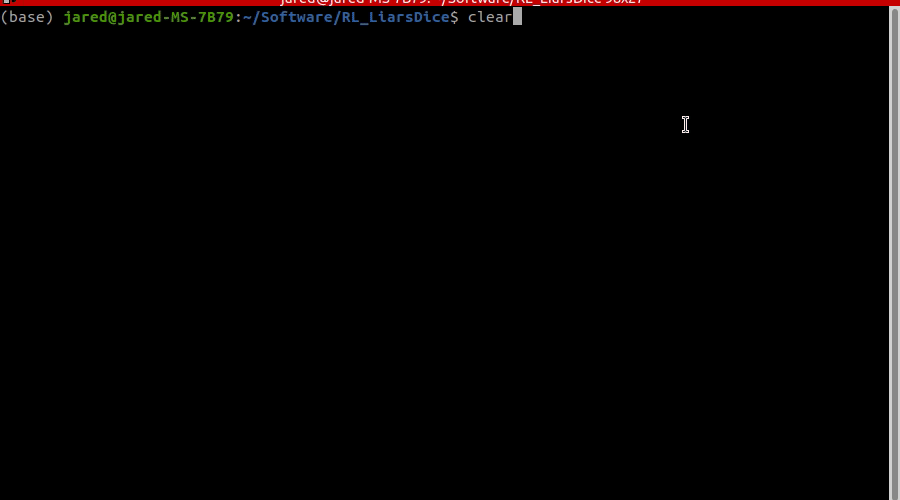

# RL_LiarsDice
Simulation of a variant of Liars Dice (Skulls and Roses) for easy integration and testing with Reinforcement Learning algorithms and other bots (see the rules to the game here: https://www.wikihow.com/Play-Skull-the-Card-Game) 

Example of some simple bots playing:

